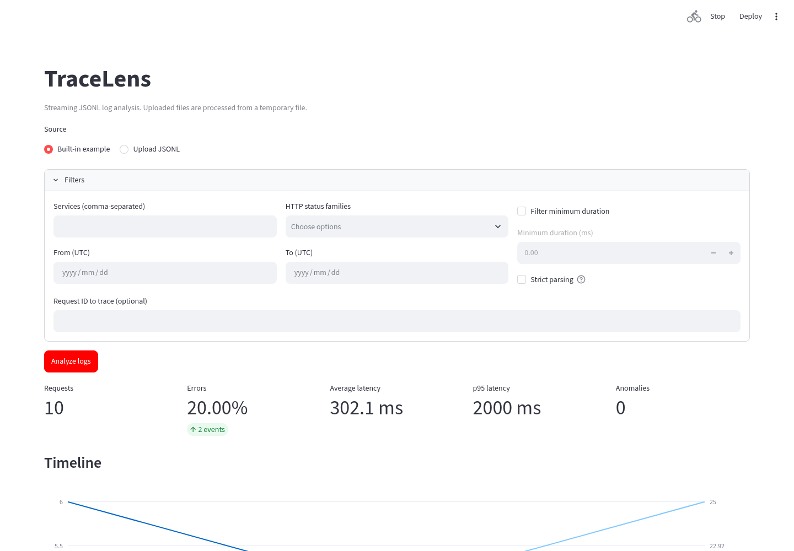

# TraceLens

TraceLens é uma ferramenta Python e dashboard Streamlit para analisar logs de aplicações em JSONL por streaming. Ele transforma um arquivo em sinais de latência, erros, endpoints, anomalias e rastreabilidade de requisições sem carregar o fluxo bruto inteiro na memória.

## O que este projeto demonstra

- Fundamentos de observabilidade: status HTTP, latência, séries temporais, sinais de incidente e correlação por requisição.
- Python orientado a desempenho: parsing incremental, agregação limitada e benchmarks reproduzíveis.
- Arquitetura testável: fronteiras tipadas, regras de domínio isoladas e testes de integração da CLI e do dashboard.

## Dashboard



Execute a demonstração local com o log de exemplo incluído:

```bash
uv sync --all-extras --dev
uv run streamlit run dashboard/app.py
```

A interface oferece exemplo embutido, upload de `.jsonl`, filtros de UTC/serviço/status/latência, linha do tempo, rankings de endpoints, painel de anomalias, busca por `request_id` e downloads JSON/HTML. O limite da demonstração pública é 100 MB; para arquivos maiores, use a CLI. O dashboard é verificado em larguras de desktop e celular por smoke test de navegador.

## Início rápido

```bash
# Veja os comandos disponíveis.
uv run tracelens --help

# Analise o exemplo pequeno incluído no repositório.
uv run tracelens analyze examples/sample.jsonl --output analysis.json
uv run tracelens report examples/sample.jsonl --output report.html

# Gere um incidente reproduzível e investigue a requisição propagada.
uv run tracelens generate --output logs.jsonl --records 100000 --seed 42 --with-incident
uv run tracelens analyze logs.jsonl
uv run tracelens trace logs.jsonl --request-id req-00016666
```

O incidente gerado ocorre na metade do fluxo e dura um minuto. Ele começa com falhas em `POST /payments` no `payments-api`, depois se propaga para `orders-api` e gateway. Com o intervalo padrão de 100 ms e 100.000 registros, ele começa em `2026-09-28T15:23:20Z`.

## Arquitetura

```text
Arquivo JSONL → parser incremental → registros tipados → Analyzer
                                                   ├─ métricas, rankings e série temporal
                                                   ├─ detector de anomalias
                                                   ├─ relatórios JSON / HTML independente
                                                   └─ CLI e dashboard Streamlit
```

O código de biblioteca fica em `src/tracelens/`; a camada Streamlit em `dashboard/app.py` apenas chama essa biblioteca. O rastreio de requisição faz uma segunda passagem incremental de propósito, evitando reter todos os IDs durante a análise principal.

## Decisões e limites

- A entrada por streaming mantém previsível o uso de memória do arquivo bruto. Grupos de endpoint e buckets temporais ainda consomem memória; por isso a cardinalidade de endpoints é limitada a 10.000 e o excedente é agrupado em `OTHER`.
- Os percentis vêm de buckets fixos de histograma de latência. São limites superiores aproximados que trocam precisão por memória estável.
- Anomalias são heurísticas explicáveis, não ML: um bucket precisa de 20 requisições e dez janelas anteriores; picos de erro usam média móvel mais três desvios padrão, e picos de latência comparam o p95 à linha de base. Tráfego esparso ou em mudança pode gerar alertas perdidos ou falsos positivos.
- Linhas inválidas são contadas com até cinco números de linha de exemplo por motivo. `--strict` interrompe no primeiro registro inválido.

Para ingestão durável, consultas distribuídas, correlação mais rica ou alertas, use uma plataforma de observabilidade de produção, como OpenTelemetry com Elasticsearch, Datadog ou outro backend gerenciado, em vez de transformar este MVP em uma delas.

## Benchmark

Medições em CPython 3.12.14 no WSL2; são informativas, não metas de CI.

| Registros | Tempo | Vazão | Pico aproximado de RSS |
| ---: | ---: | ---: | ---: |
| 100.000 | 2,10 s | 47.679 linhas/s | 29,5 MB |
| 1.000.000 | 21,85 s | 45.767 linhas/s | 34,0 MB |

Execute sua própria medição com `uv run tracelens benchmark logs.jsonl --output benchmark.json`.

## Desenvolvimento e qualidade

São necessários Python 3.12+ e [uv](https://docs.astral.sh/uv/).

```bash
uv sync --all-extras --dev
uv run ruff format --check .
uv run ruff check .
uv run mypy src
uv run pytest --cov=tracelens --cov-fail-under=85
uv build
```

O GitHub Actions executa as mesmas verificações em pushes e pull requests. Arquivos JSONL são excluídos propositalmente da formatação automática, porque cada linha física é um registro JSON independente.

## Publicação do dashboard

O Streamlit Community Cloud pode usar `dashboard/app.py` como entrypoint. `requirements.txt` instala o pacote local com o extra `dashboard`, e `.streamlit/config.toml` aplica o limite de upload de 100 MB. Não há uma demonstração pública configurada neste repositório.

## Roadmap

O MVP exclui intencionalmente banco de dados, autenticação, ingestão em tempo real e integrações com fornecedores. Próximos passos possíveis incluem entrada gzip, mapeamento configurável de campos, quantile sketches, agregação paralela, exportação OpenTelemetry e comparações com DuckDB.
